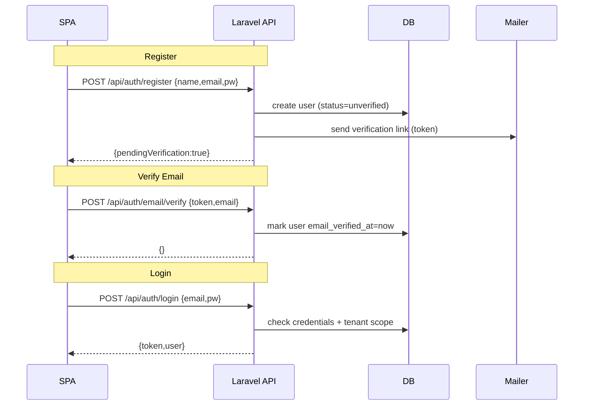
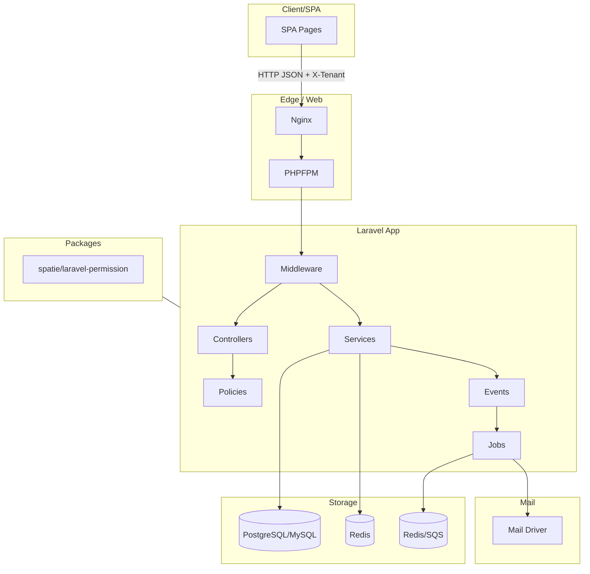

# Laravel Multi-Tenant Setup (Spatie Permissions + Tenant Middleware)

This package contains a ready-to-use multi-tenant configuration for Laravel 12+ using **Spatie Laravel Permission** with **teams/tenants support**.

# Yamato Monorepo Structure

Below is the folder tree for the Yamato project.  
It includes the **shared SASS design system**, the **React SPA frontend**, and a placeholder for the **Laravel API**.

```text
yamato/                                                   // Monorepo root (Next.js frontend + Laravel API placeholder)
├─ package.json                                           // (optional) root scripts (e.g., "dev:web", "dev:api")
├─ .editorconfig                                          // Editor settings
├─ .gitignore                                             // node_modules, .next, dist, build, .env*, etc.
│
├─ web/                                                     // Next.js app (frontend only) + ALL SCSS
│  ├─ package.json                                          // Next.js + React + TS deps/scripts
│  ├─ next.config.ts                                        // Next config; rewrites to proxy /api → backend (dev)
│  ├─ tsconfig.json                                         // TS config + path aliases (@ → src)
│  ├─ .env.local.example                                    // NEXT_PUBLIC_API_URL= http://localhost:8000
│  ├─ public/                                               // Static assets served as-is
│  │  ├─ favicon.svg                                        // App icon
│  │  └─ robots.txt                                         // Crawler rules
│  │
│  └─ src/
│     ├─ app/                                               // App Router (RSC/SSR/SSG)
│     │  ├─ layout.tsx                                      // Root layout; global styles import
│     │  ├─ page.tsx                                        // Public Home (SSR/RSC)
│     │  ├─ (public)/                                       // Optional: segment for public pages
│     │  │  ├─ about/page.tsx                               // About/Team
│     │  │  └─ pricing/page.tsx                             // Pricing/FAQ
│     │  ├─ (secure)/                                       // Auth-guarded segment (client or mixed)
│     │  │  └─ dashboard/page.tsx                           // Secure dashboard (KPI/Bento)
│     │  └─ middleware.ts                                   // (optional) edge auth/redirects for / (secure)
│     │
│     ├─ components/                                        // Reusable UI
│     │  ├─ ui/
│     │  │  └─ Icons.tsx                                    // Icon hero
│     │  ├─ public/
│     │  │  ├─ Hero.tsx                                     // Marketing hero
│     │  │  ├─ MarketingCard.tsx                            // Feature card
│     │  │  ├─ PublicNavbar.tsx                             // Public navbar
│     │  │  └─ PublicFooter.tsx                             // Public footer
│     │  └─ secure/
│     │     ├─ Topbar.tsx                                   // Search/user menu
│     │     ├─ Sidebar.tsx                                  // App navigation
│     │     ├─ KpiTile.tsx                                  // Single KPI tile
│     │     ├─ KpiGrid.tsx                                  // KPI grid
│     │     ├─ BentoCard.tsx                                // Bento widget
│     │     ├─ DataTable.tsx                                // Sort/filter table
│     │     ├─ Modal.tsx                                    // Modal/dialog
│     │     ├─ Tabs.tsx                                     // Tabs & panels
│     │     ├─ Toasts.tsx                                   // Toast host
│     │     └─ ChartContainer.tsx                           // Responsive chart container
│     │
│     ├─ lib/                                               // Frontend helpers/clients
│     │  ├─ api.ts                                          // fetch wrapper reading NEXT_PUBLIC_API_URL
│     │  └─ auth.ts                                         // minimal auth helper (cookie/JWT handling)
│     │
│     ├─ styles/                                            // 🔁 All SCSS lives here (public + secure)
│     │  ├─ app.scss                                        // Optional umbrella; can @use public/secure
│     │  ├─ _print.scss                                     // Print styles
│     │  ├─ _rtl.scss                                       // RTL helpers (dir flips, logical props)
│     │  ├─ _icons.scss                                     // icons
│     │  │
│     │  ├─ core/                                           // Design primitives (shared)
│     │  │  ├─ _reset.scss                                  // Normalize/reset + base elements
│     │  │  ├─ _tokens.scss                                 // Colors, spacing, radii, shadows, z-index, breakpoints
│     │  │  ├─ _typography.scss                             // Type scale, headings, utilities
│     │  │  ├─ _functions.scss                              // token(), clampScale(), color-mix helpers
│     │  │  ├─ _mixins.scss                                 // mq(), container(), focus-ring(), truncate()
│     │  │  ├─ _utilities.scss                              // Display/position/spacing/overflow/visually-hidden
│     │  │  └─ _accessibility.scss                          // Skip-links, focus-visible, contrast tweaks
│     │  │
│     │  ├─ themes/                                         // Theme variable layers (shared)
│     │  │  ├─ _light.scss                                  // :root light-mode vars
│     │  │  └─ _dark.scss                                   // [data-theme="dark"] overrides
│     │  │
│     │  ├─ vendor/
│     │  │  └─ _charts.scss                                 // Chart theming (axes, tooltip, legend)
│     │  │
│     │  ├─ public/                                         // PUBLIC bundle (unauthenticated)
│     │  │  ├─ public.scss                                  // Entry: @use ../core, ../themes, ./_index
│     │  │  ├─ _index.scss                                  // Collects base/components/pages
│     │  │  ├─ base/
│     │  │  │  ├─ _globals.scss                             // Body bg, links, containers (marketing)
│     │  │  │  ├─ _layout.scss                              // Sections, grids, wrappers
│     │  │  │  ├─ _header.scss                              // Navbar, logo, mobile menu
│     │  │  │  └─ _footer.scss                              // Footer grid, newsletter, legal
│     │  │  ├─ components/
│     │  │  │  ├─ _hero.scss                                // Hero blocks (headline/media/ribbons)
│     │  │  │  ├─ _buttons.scss                             // CTA/ghost/link variants & sizes
│     │  │  │  ├─ _cards.scss                               // Feature/testimonial/logo tiles
│     │  │  │  ├─ _forms.scss                               // Simple forms + validation states
│     │  │  │  └─ _badges.scss                              // Pills/labels (brand/neutral/status)
│     │  │  └─ pages/
│     │  │     ├─ _home.scss                                // Landing sections, CTA bands, FAQ
│     │  │     ├─ _about.scss                               // Team grid, timeline, values
│     │  │     └─ _pricing.scss                             // Pricing tables, highlights, compare
│     │  │
│     │  └─ secure/                                         // SECURE bundle (authenticated app)
│     │     ├─ secure.scss                                  // Entry: @use ../core, ../themes, ./_index
│     │     ├─ _index.scss                                  // Collects base/components/modules/pages
│     │     ├─ base/
│     │     │  ├─ _globals.scss                             // App defaults (scrollbars/selection), density
│     │     │  ├─ _layout.scss                              // Topbar/Sidebar/Content grid, resizable panes
│     │     │  ├─ _topbar.scss                              // Topbar size, search, user menu
│     │     │  └─ _sidebar.scss                             // Nav groups, active/hover, collapse rail
│     │     ├─ components/
│     │     │  ├─ _buttons.scss                             // Icon-only, split, loading, destructive
│     │     │  ├─ _badges.scss                              // Status chips (semantic colors)
│     │     │  ├─ _tables.scss                              // Density, sticky headers, row states
│     │     │  ├─ _forms.scss                               // Inputs/selects/switches, error summaries
│     │     │  ├─ _modals.scss                              // Modal/drawer shells & sizes
│     │     │  ├─ _tabs.scss                                // Tabs (underline/pills), panels
│     │     │  ├─ _toasts.scss                              // Toast positions/stacking/variants
│     │     │  └─ _charts.scss                              // Chart container sizing, legends
│     │     ├─ modules/
│     │     │  ├─ _auth.scss                                // Login/Register/2FA screens
│     │     │  ├─ _kpi-grid.scss                            // KPI tiles (40–120px), condensed grid
│     │     │  ├─ _bento.scss                               // Bento dashboards (s/m/l cards)
│     │     │  ├─ _audit.scss                               // Audit log: severity colors, filters
│     │     │  └─ _rbac.scss                                // Role/permission matrix, sticky col
│     │     └─ pages/
│     │        ├─ _dashboard.scss                           // Widget grid defaults, gaps, quick actions
│     │        ├─ _documents.scss                           // List + preview split, file badges
│     │        ├─ _settings.scss                            // Sectioned forms, sidebar tabs, danger zone
│     │        └─ _profile.scss                             // Profile card, avatar, security keys
│     │
│     ├─ utils/                                             // Generic helpers
│     │  ├─ format.ts                                       // Money/date/percent formatters
│     │  └─ constants.ts                                    // Paths, enums, constants
│     └─ assets/
│        ├─ images/                                         // Logos/illustrations
│        └─ fonts/                                          // Self-hosted fonts
│
├─ api-laravel/                                              // Backend (separate service; peer of web/)
│  └─ README.md                                              // Placeholder for future Laravel API
│
└─ docs/
   └─ INTEGRRATION.md                                        // Notes on SPA + styles; API wiring TBD


```
## 📂 Included Files

- **composer.json**  
  Autoload configuration with PSR-4 namespaces and `app/helpers.php` autoloaded.

- **app/helpers.php**  
  Defines helper functions like `tenant()` and `is_truthy()`.

- **app/Models/Tenant.php**  
  Eloquent model for tenants.

- **app/Http/Middleware/SetCurrentTenant.php**  
  Middleware to resolve the current tenant via:
  - `X-Tenant` header
  - URL path `/t/{slug}`
  - Subdomain `{slug}.yourapp.test`

- **database/migrations/2025_09_05_000000_create_tenants_table.php**  
  Migration to create the `tenants` table.

- **database/seeders/TenantRbacSeeder.php**  
  Seeder that:
  - Creates demo tenants (`acme`, `umbrella`)
  - Seeds roles (`admin`, `manager`, `viewer`) per tenant
  - Seeds permissions (`users.*`, `orders.*`)
  - Assigns the first user in the DB as an `admin` in each tenant

## ⚙️ Installation Steps

1. Install Spatie Permissions:
   ```bash
   composer require spatie/laravel-permission
   php artisan vendor:publish --provider="Spatie\Permission\PermissionServiceProvider" --tag="permission-config"
   php artisan vendor:publish --provider="Spatie\Permission\PermissionServiceProvider" --tag="permission-migrations"
   php artisan migrate
   ```

2. Enable teams in `config/permission.php`:
   ```php
   'teams' => [
       'enabled' => true,
       'team_model' => App\Models\Tenant::class,
       'team_foreign_key' => 'tenant_id',
       'teams_morph_key' => null,
   ],
   ```

3. Register the middleware in `bootstrap/app.php`:
   ```php
   ->withMiddleware(function (Middleware $middleware) {
       $middleware->alias([
           'tenant' => \App\Http\Middleware\SetCurrentTenant::class,
       ]);
   })
   ```

4. Run migrations:
   ```bash
   php artisan migrate
   ```

5. Seed tenants, roles, and permissions:
   ```bash
   php artisan db:seed --class=TenantRbacSeeder
   php artisan permission:cache-reset
   ```

## ✅ Usage

### Routes Example

```php
use Illuminate\Support\Facades\Route;
use App\Http\Controllers\DashboardController;
use App\Http\Controllers\OrderController;

Route::get('/', fn() => view('welcome'));

// Tenant-aware routes (require auth + tenant)
Route::middleware(['auth:sanctum','tenant'])->group(function () {
    Route::get('/dashboard', [DashboardController::class, 'index'])
        ->middleware('role:admin');

    Route::get('/orders', [OrderController::class, 'index'])
        ->middleware('permission:orders.view');

    Route::post('/orders', [OrderController::class, 'store'])
        ->middleware('permission:orders.create');
});
```

### Resolve tenant in code:
```php
$tenant = tenant();
echo $tenant?->name;
```

### Assign roles scoped to the current tenant:
```php
$user->assignRole('admin'); // applies to resolved tenant
```

## 🔒 Notes

- Global middleware applies to all requests, route middleware only where added.  
- Choose **route middleware** if you have public routes (landing pages, docs, auth).  
- Choose **global middleware** if your entire app is tenant-scoped.

---

Happy coding 🚀
