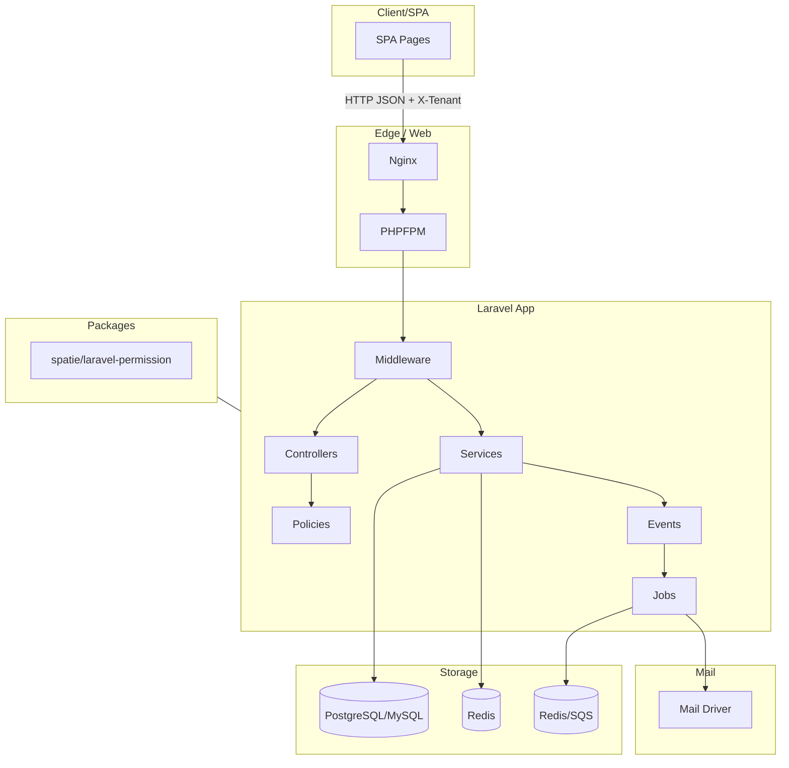

# Laravel Multi-Tenant Setup (Spatie Permissions + Tenant Middleware)

This package contains a ready-to-use multi-tenant configuration for Laravel 12+ using **Spatie Laravel Permission** with **teams/tenants support**.


## 📂 Included Files

- **composer.json**  
  Autoload configuration with PSR-4 namespaces and `app/helpers.php` autoloaded.

- **app/helpers.php**  
  Defines helper functions like `tenant()` and `is_truthy()`.

- **app/Models/Tenant.php**  
  Eloquent model for tenants.

- **app/Http/Middleware/SetCurrentTenant.php**  
  Middleware to resolve the current tenant via:
  - `X-Tenant` header
  - URL path `/t/{slug}`
  - Subdomain `{slug}.yourapp.test`

- **database/migrations/2025_09_05_000000_create_tenants_table.php**  
  Migration to create the `tenants` table.

- **database/seeders/TenantRbacSeeder.php**  
  Seeder that:
  - Creates demo tenants (`acme`, `umbrella`)
  - Seeds roles (`admin`, `manager`, `viewer`) per tenant
  - Seeds permissions (`users.*`, `orders.*`)
  - Assigns the first user in the DB as an `admin` in each tenant

## ⚙️ Installation Steps

1. Install Spatie Permissions:
   ```bash
   composer require spatie/laravel-permission
   php artisan vendor:publish --provider="Spatie\Permission\PermissionServiceProvider" --tag="permission-config"
   php artisan vendor:publish --provider="Spatie\Permission\PermissionServiceProvider" --tag="permission-migrations"
   php artisan migrate
   ```

2. Enable teams in `config/permission.php`:
   ```php
   'teams' => [
       'enabled' => true,
       'team_model' => App\Models\Tenant::class,
       'team_foreign_key' => 'tenant_id',
       'teams_morph_key' => null,
   ],
   ```

3. Register the middleware in `bootstrap/app.php`:
   ```php
   ->withMiddleware(function (Middleware $middleware) {
       $middleware->alias([
           'tenant' => \App\Http\Middleware\SetCurrentTenant::class,
       ]);
   })
   ```

4. Run migrations:
   ```bash
   php artisan migrate
   ```

5. Seed tenants, roles, and permissions:
   ```bash
   php artisan db:seed --class=TenantRbacSeeder
   php artisan permission:cache-reset
   ```

## ✅ Usage

### Routes Example

```php
use Illuminate\Support\Facades\Route;
use App\Http\Controllers\DashboardController;
use App\Http\Controllers\OrderController;

Route::get('/', fn() => view('welcome'));

// Tenant-aware routes (require auth + tenant)
Route::middleware(['auth:sanctum','tenant'])->group(function () {
    Route::get('/dashboard', [DashboardController::class, 'index'])
        ->middleware('role:admin');

    Route::get('/orders', [OrderController::class, 'index'])
        ->middleware('permission:orders.view');

    Route::post('/orders', [OrderController::class, 'store'])
        ->middleware('permission:orders.create');
});
```

### Resolve tenant in code:
```php
$tenant = tenant();
echo $tenant?->name;
```

### Assign roles scoped to the current tenant:
```php
$user->assignRole('admin'); // applies to resolved tenant
```

## 🔒 Notes

- Global middleware applies to all requests, route middleware only where added.  
- Choose **route middleware** if you have public routes (landing pages, docs, auth).  
- Choose **global middleware** if your entire app is tenant-scoped.

---

Happy coding 🚀
