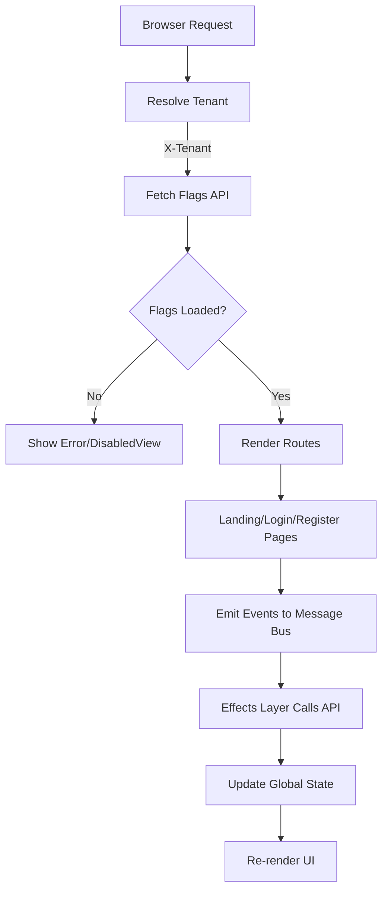
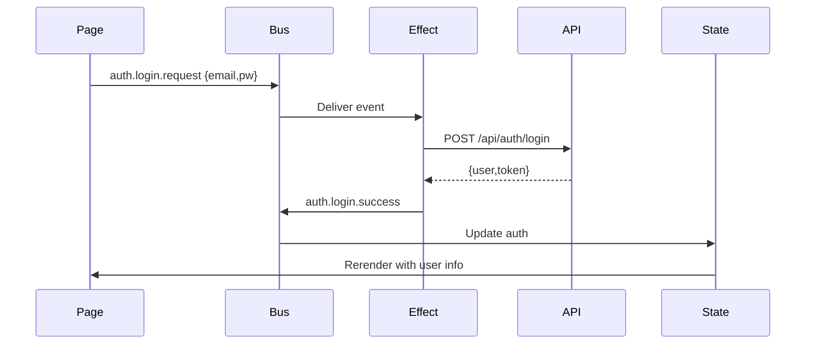

# ✅ Yamato SaaS Frontend – Setup Checklist

This README tracks the **steps to build the public-facing frontend flows** for Yamato.

---

## 📖 Overview
React app providing multi-tenant **public flows**:

- [ ] Landing page
- [ ] Login
- [ ] Register
- [ ] Email confirmation
- [ ] Password recovery
- [ ] Settings → Public Pages (admin-only, future)
- [ ] Global navigation bar (links to login/register)
- [ ] Footer with support/help links
- [ ] Toast/notification system
- [ ] DisabledView component (for disabled pages)

All flows are **tenant-aware** and respect **server-driven flags**.

---

## 🛠 Step 1 – Tenancy Setup
- [ ] Subdomain support (`{tenant}.example.com`)
- [ ] Path prefix support (`/t/{tenant}`)
- [ ] Parse tenant slug from URL
- [ ] Store tenant in global state
- [ ] Ensure API requests send `X-Tenant: <slug>`
- [ ] Fallback tenant for local dev (`VITE_DEFAULT_TENANT`)
- [ ] Error handling: unknown tenant → show error page

---

## 🔧 Step 2 – Public Feature Flags
- [ ] Fetch flags from `GET /api/public/flags`
- [ ] Cache flags with TTL (configurable, default 5 min)
- [ ] Disabled page renders **DisabledView**
- [ ] Refresh flags on demand (admin action)
- [ ] Show tenant name in header
- [ ] Graceful fallback if flags API fails

Flags to implement:
- [ ] `public_pages.landing.enabled`
- [ ] `public_pages.login.enabled`
- [ ] `public_pages.register.enabled`
- [ ] `public_pages.email_verification.enabled`
- [ ] `public_pages.password_recovery.enabled`

---

## 📡 Step 3 – Communication Between Components
- [ ] Global State (auth, tenant, flags, UI)
- [ ] Message Bus for events
- [ ] Effects layer to handle API calls
- [ ] UI toast system (subscribed to bus)
- [ ] Routing guard (respects flags + auth state)
- [ ] Network status tracker (`online/offline`)
- [ ] Modal system integrated via bus

---

## 🌐 Step 4 – API Contracts
- [ ] `GET /api/public/flags`
- [ ] `POST /api/auth/login`
- [ ] `POST /api/auth/register`
- [ ] `POST /api/auth/email/verify`
- [ ] `POST /api/auth/password/forgot`
- [ ] `POST /api/auth/password/reset`
- [ ] (Future) `GET/PUT /api/admin/public-pages`
- [ ] (Optional) `GET /api/auth/me` (for refresh)

---

## 📄 Step 5 – Pages
- [ ] Landing → `/`
- [ ] Login → `/login`
- [ ] Register → `/register`
- [ ] Verify Email → `/verify-email?token=...&email=...`
- [ ] Forgot Password → `/forgot-password`
- [ ] Reset Password → `/reset-password?token=...&email=...`
- [ ] PublicPagesSettings → `/settings/public-pages` (future)
- [ ] DisabledView reusable component

---

## 🔒 Step 6 – Security
- [ ] Token storage in memory (preferred) or HttpOnly cookie
- [ ] HTTPS enforced (local dev: self-signed certs)
- [ ] CSRF handling (only if cookie auth mode)
- [ ] Map backend errors to canonical codes:
  - AUTH_INVALID_CREDENTIALS
  - AUTH_EMAIL_UNVERIFIED
  - AUTH_TOKEN_EXPIRED
  - TENANT_NOT_FOUND
  - FEATURE_DISABLED
  - RATE_LIMITED
  - NETWORK_ERROR
  - UNKNOWN

---

## 🧪 Step 7 – Tests
- [ ] Routing for all public pages (subdomain + path mode)
- [ ] Disabled pages render DisabledView
- [ ] Auth happy paths: login, register→verify, forgot→reset
- [ ] Auth errors: invalid creds, expired tokens
- [ ] Unit tests for effects (event → API → success/error)
- [ ] Toasts appear on success/error
- [ ] Tenant error handling tested
- [ ] Flags API failover tested

---

## 📦 Environment Variables
- [ ] `VITE_API_BASE_URL`
- [ ] `VITE_TENANCY_MODE` = `subdomain|path`
- [ ] `VITE_DEFAULT_TENANT` (path mode dev)
- [ ] `VITE_PUBLIC_FLAGS_TTL_MS`
- [ ] `VITE_APP_NAME`
- [ ] `VITE_ENABLE_TELEMETRY`

---

## 🗂 Boot Sequence
- [ ] Resolve tenant from URL
- [ ] Fetch flags with `X-Tenant`
- [ ] Mount routes
- [ ] Load landing/login/register lazily
- [ ] Subscribe effects to bus
- [ ] Render DisabledView where needed

---

## 🎨 Future Enhancements
- [ ] Multi-language i18n (EN/ES)
- [ ] Accessibility pass (WCAG AA)
- [ ] Self-hosted telemetry/analytics
- [ ] Dark/light theme toggle
- [ ] PWA offline support

---

## 📊 Diagrams

### High-Level Flow (Mermaid)

### Component Communication

---
